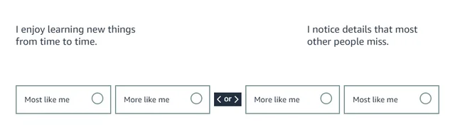
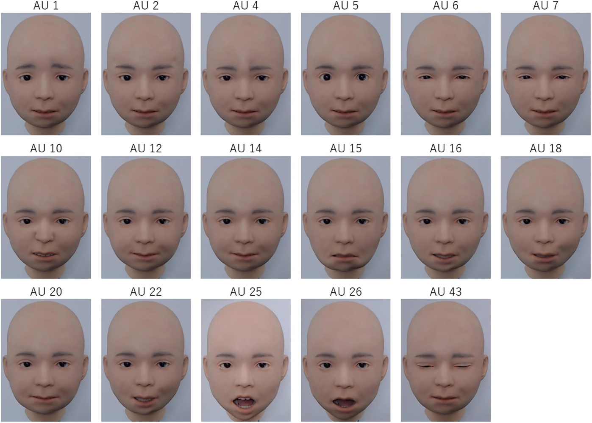

_[This article is based on my personal experiences looking for a junior/entry tech role in the UK in 2024 as a bootcamp graduate.]_

So, I just finished up at Makers Academy, armed with solid training and a big dose of confidence. I thought I'd be that person on LinkedIn bragging about landing a tech job in 30 days. Spoiler alert: that didn’t happen. Instead, it took me five long months of full-time job hunting (yes, at least 40 hours a week), over 100 versions of my CV, 5 phone screenings, 25 automated assestments, 8 video interviews and 4 tech interviews to finally land a junior software engineer role. This isn't an advice column, but rather a survival tale from the UK tech job market trenches.

## It’s Not You, It’s... Not Them. It’s the Market.

If you’re switching careers, fresh out of bootcamp or university, and hunting for a job, you’ve probably heard that the market is “tough” right now. Yeah, understatement of the year. Talking to recruiters, colleagues, and fellow grads, there's a sense of dramatic lack of junior tech roles. The number of applications for each job is insane. Companies have resorted to automated selection processes: video interviews scored by AI, game-based assessments, cognitive tests, pattern recognition tests, and timed coding tests that have nothing to do with the actual job. Or if keeping it old-school and using actual humans to look through CVs usually it was time-sensitive: you had to apply withing first 24h so that your CV is not burried under hundreds of others.

One job I reached the final stage for had 600 applicants, and only 6 made it to the last round. With 2 job offers on the table, that's a 1% chance just to get to the end. So, yes, I felt like a lottery winner just making it that far.

## Desperation and Constant Rejection Is a Mental Health Nightmare.

I was lucky enough to be in a situation where I could job hunt without any income for seven months. But with each passing month, my desperation grew.

Initially, I only looked at roles with tech stacks I knew. Reality check: if I could learn anything, I needed to expand my stack and apply to any available roles since there were so few. I figured out that from application to actual phone screening to technical interview could take weeks, if not months, so I could always learn the necessary languages or frameworks while waiting for interview dates. For example, when I was prepping for a third-stage technical coding interview, I had two weeks to learn Ruby. Learning new languages is easier when you already know one or two, so it wasn't too bad.

After a few months, I lowered my salary expectations. Instead of aiming for higher-paying jobs, I started applying for lower-paid positions. I couldn’t job hunt forever. I was shocked to find that jobs barely paying the London Living Wage (and let’s be real, Londoners, that wage is not livable 🤣) had four or more recruitment stages and the same insane competition.

Dealing with constant rejection, even for low-paying positions where I ticked all the boxes, takes a toll on your mental health. Initially, I was immune to rejections, but over time, that shield weakened. Don’t get me wrong; every rejection, failed interview, or technical challenge was part of the journey. Thanks to this practice, I eventually landed three job offers, but some days, the rejection hit hard.

## It's More Automated Than a Self-Driving Car.

https://www.reddit.com/r/WorkReform/comments/u21i3p/fucking_personality_tests_in_2022wtf_amazon_what/

I noticed that most junior, graduate, internship, or apprenticeship jobs have a highly automated recruitment process. I was surprised at how little coding was involved. We're talking about four or five recruitment stages involving cognitive tests, company fit tests, personality tests, pattern recognition tests, emotional intelligence tests, and video recording interviews.

It's a very similar example of what my assestment looked like. 

It's a very similar example of what my assestment looked like. Source:
The most shocking test was for one of the FAANG companies, measuring my emotional intelligence. I was presented with pictures of creepy, human-like (or should I say alien-like 👽) AI-generated faces and asked to recognize emotions.

Another test measured my motivation by having me play an unwinnable game. I could give up anytime, but if I quit before 10 minutes, I failed. Quitting between 10-20 minutes was okay; my motivation was high enough. Giving up after 30 minutes meant I was overdoing it and wouldn't be efficient at work.

I lost count of how many of these I did, but over time, I got better at them. Reading Reddit, I see many people refuse to participate in these AI-scored assessments, calling them inhumane and a waste of time. But in my job search, they were unavoidable. Preparing for hours for video recording interviews, only to have 60 seconds to answer each question and then get suspiciously quick rejections (thanks, AI), became a norm. My facial expressions and body language were analyzed, voice speed and pitch assessed for confidence and communication. Answers were parsed with natural language processing tools, comparing my responses to keywords and scoring me against hundreds of other applicants. After more than 15 of these interviews, I mastered them and landed a few final-stage interviews.

## It's a matter of WHEN not IF. Keep faith.

Reaching out to my network and socializing with other job hunters through the Makers Alumni Hub and [codebar](https://codebar.io/) helped me remember that we're all in the same boat. Job hunting while on a career break can get lonely. It's crucial to remember that finding a job is tough because of the market, not because of your value or skills. It's a matter of time, and **you won't be in this position forever.**
